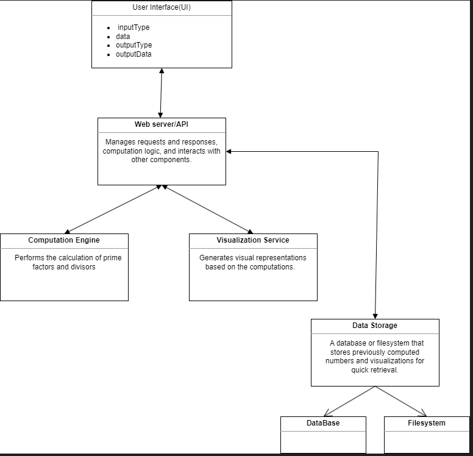

PROJECT INFORMATION 
 This project is a web application that creates an interactive display showcasing the prime factors and divisibility of any given number. Users input a number, and the application will present a dynamic chart or diagram illustrating which prime numbers divide it and highlighting its prime factorization. This tool merges basic mathematic principles with engageable visuals, making it an excellent resource for learning about number properties. 

SYSTEM DIAGRAM

EXAMPLE INPUT 
{
    inputType: "json", //indicates the format of the input, JSON
    data: "{\"number\": 30}", //contains the actual data tobe processed
    outputType: "json", // specifies how the output should be formatted
    outputData: "" // initially empty, as it will be filled  with the result of the computation
}

EXAMPLE OUTPUT
{
    outputType: json,
    data: {
        number: 30,
        primeFactors: [2, 3, 5],
        divisors: [1, 2, 3, 5, 6, 10, 15, 30],
        visualization: "image",
    }
}

